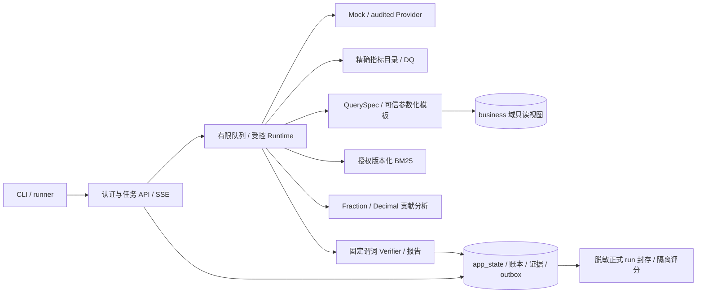

# DataAgentX 总体设计方案 v1.2

日期：2026-10-09；DAX-RB-1.2。当前完整总体设计，取代v1.0及v1.1补丁的实施指导。详细设计规格已修订，关键原型与应用验收待完成。

## 1. 场景和边界

模拟电商成熟支付队列退款率调查；固定快照/指标版本，两窗/H/as_of/水位确认。总体或一个授权地区内按一个category/region/channel分组，先过滤后聚合；确定性贡献与待验证假设分层。H=7天/UTC仅登记默认，拒绝未成熟队列，不新增实时事件率/通用Text-to-SQL/任意代码/因果识别。

## 2. 系统结构与交互

单Python/FastAPI进程、一个PG实例分business/app_state；单任务串行工具，短事务CAS，接口取消与后台等待分离。用户→授权/幂等/容量→queued→Scope解释/澄清→冻结→DQ→规划/查询/检索/分析→核验→唯一终态/报告。IF01客户端、IF02DB、IF03知识导入、IF04Provider、IF05分析、IF06条件Memory、IF07隔离评测；每个输入输出遵守同Scope/域/版本。

## 3. 跨模块不变量

Scope含filters.region_ids=[]或[一个授权ID]；QuerySpec仅选择模板/分组并引用scope_hash，不收过滤覆写/candidate_sql。外部显式偏移时间规范到UTC微秒Z；规范hash包含过滤与所有口径、排除分配型scopeID/version，实体关系仍单独校验。Aggregation/Claim以维度ID/组ID/贡献分量/公式区分，名字只显示。

默认1执行/16队列，累计就绪排队30秒/active120秒/人工澄清1800秒分别计；重入不重置，e2e另报。容量前429不建任务、已受理队列超时failed；所有结束关闭新发，首次CAS终态唯一。工具12/模型8，audited本地估算20000/输出cap4000与外部usage分层，未知不当0；取消2/5/10秒。REST取消/SSE观察为核心，断流不取消；无控制WS/公开DELETE。

业务域只读角色/视图与应用库/迁移凭据分离；数据/知识/缓存/证据/报告/日志/导出同域所有权。普通trace7天/任务30天/幂等24h；正式run全必要脱敏原始证据TTL前封存、读回重评分后180天，标签隔离。默认无备份，SC-02未选不承诺恢复。

## 4. 模块责任与有效文档

DD01身份/生命周期；DD02数据/公式/过滤/查询安全；DD03Runtime/三时钟/预算/Provider；DD04检索/Claim/核验/报告；DD05存储/规范hash/API/集成；DD06独立评测/负载；DD07部署/版本/留存；DD08条件增强。全部使用v1.2文件，不依赖覆盖式补丁。完整列表和状态见同阶段设计总册；34项追溯JSON指向各模块。

## 5. 验证和开发出口

按V流程以需求/场景定义验证：先独立fixture/Oracle，后真实PG权限/参数化，再确定性报告，继而Mock状态/预算/取消、真实小样本、检索CAL-R01/负载CAL-P01、120case正式三轮/公平基线/新环境走查。Schema/参考计算不是DB或Agent运行验收。

正式动态盲测≥30、五机制各≥6，保持六业务类各10；质量差/成本/配对区间共同解释，不预设B2胜。CAL-R01/CAL-P01未实测数值不得填通过。Memory、四策略检索、Go、SC-01/02延后，MCP/UI按Could；无需继续扩栈才能开始第一条可复算链路。
