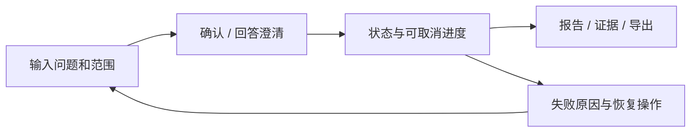

# DD08 增强功能与扩展设计 v1.2

日期：2026-10-09。覆盖全部6项Should（F16–F20、N11）与3项Could（F21/F22/N12）。状态：接口、生命周期、条件与实验设计完成；全部默认关闭，未实现/未运行。遵循当前需求评审CF01–CF07，保留原长期规划的优先级差异记录，不声称拥有者已签署降级。能力设计完整不意味着必须在R0实现每个增强。

## 1. 最小案例Memory（F16/F17/N11）

MemoryStore协议：propose、review、commit_version、retrieve、invalidate、delete；Planner只能retrieve，不能自行批准模型假设。写入来自已终态且已核验报告的TaskEpisode，必要BusinessFact单独保存；operator审阅来源/域/时间/陈述等级后批准。用户明确更正和当前数据优先，旧案例只指导调查，不证明当前异常。

记录字段：memory_id、entity_key、record_type、domain_id、允许主体/域、source_task/report/evidence版本与hash、内容摘要与支持类型、valid_from/to、created_at、reviewer_id/review_time、version、status、supersedes、fingerprint。状态为proposed/approved/superseded/conflict/expired/deleted；只有approved且当前授权/有效区间满足的记录参与召回。

重复=同实体、来源版本和规范内容fingerprint相同，忽略并审计。事实变化以事务关闭旧有效版本并新增，保留版本链；有效期重叠且来源不支持统一时两者标conflict并返回明确冲突提示，不能静默选向量分高者。无来源禁止自动语义合并。更正/撤权/源数据删除立即失效，缓存版本递增并移除索引；读时仍检查状态，不仅依赖后台删索引速度。

批准的合成案例管理包可按DD01保留180天，但必须显式登记且包含最小必要来源聚合/授权依据；不能用复制来延长已要求删除的内容。原任务删除时关联Memory一并失效/清理；源证据不可读或过期则禁止召回为有效事实。若需要长期保留独立合成案例，必须先生成独立审阅的非个人合成发布资料，而不是偷偷引用过期任务。

检索先权限、状态、实体、有效期/来源过滤，再相关性排序；top-k候选默认3，片段≤800字符，纳入统一上下文/Token预算。当前SQL/DQ与Memory冲突时当前数据优先，报告显示冲突及恢复方法；无历史必要性的任务可以不查Memory。

## 2. 四记忆基线与启用

冻结≥40独立多任务序列，先划分历史相关/不相关子集，再运行No Memory、Full History、Vector Memory、最小结构化Memory，各≥3轮，总计≥480序列运行。一个序列内任务有时序依赖；不同序列清空历史且机制隔离。Full History也不能突破预算，超长按预先固定规则截断并披露；Vector仅语义召回也必须守权限，不为制造差异移除安全底线。

序列覆盖稳定复用、事实更新、过期、未决冲突、用户更正、错误模型假设污染、域撤权、删除/缓存失效、跨实体相似文本；污染/权限/时效硬例零违规。不同策略使用相同模型/工具、总预算、输入历史与配置，所用Memory类型是自变量。

默认启用须历史相关子集成功率相对No Memory≥+5个百分点、总体不下降超过2个百分点，且硬例全部通过。按DD06以序列为统计单位报告配对差值/区间、成本、Token、延迟；无收益仍可完成F18实验验收，结论为默认关闭。不是只选最有利子集或最好一轮。

## 3. 四检索策略（F19）

所有策略共用DD04的文档/片段、权限、有效期、版本过滤与标签集：BM25为R0参考；Dense为固定embedding模型/维度/归一化/版本索引；Hybrid使用两路各top20，经RRF合并（设计默认k=60，排序分Σ1/(60+rank)，稳定ID打破并列）；Hybrid+Rerank在合并top20上由固定reranker重排后取top5。无权限/过期片段不得先送外部模型再过滤。

新增模型/依赖/索引空间、重建时间登记；无GPU硬要求，可CPU小规模或经授权外部API。外部embedding/reranker保守纳入模型请求与输入预算，输出Token按服务实际计数语义绑定；向量本身不伪称文本Token。无法校准usage/计数上界时不启用外部路径；本地模型也记录CPU/RSS、耗时和外部调用为0的依据，不伪称整体成本为0。

同≥60查询比较Recall@5/MRR@5，另做调查任务质量消融。实验前冻结主指标和可接受退化，设计默认：对BM25 Recall@5提高≥0.03、调查成功率下降≤0.02、安全时效硬例全过，且满足N03/N05；这些是F19方案选择参数，不修改F08已有0.80门槛。未达到保留实验记录、继续BM25；若BM25连R0门槛也不过，则先修复F08，不把核心缺陷推给可选实验。

## 4. Go网关（F20）

有限反向代理：验证/生成request_id、总并发准入、请求期限、Bearer转发、SSE逐事件flush及取消/控制连接转发。身份/数据域/预算的最终裁决仍在Python；网关不能相信调用方传来的principal或改写task归属。默认不缓存任务结果、不复制业务SQL、不成为第二Runtime。

请求生命周期：接收→限流→转发创建→返回task_id；SSE断开只结束观察转发，不自动取消调查。用户显式cancel原样传后端；若代理控制WS须保持唯一租约/epoch协议并转发断连，不能自行创建第二控制者。网关重启的控制断连走既有5秒恢复；未支持控制代理前不能启用要求control模式的任务。网关上下游超时/close不能被误当后端已取消，必须记录后端清理证据。

对照固定同一Python后端、数据/请求/硬件/缓存/池：无网关与有网关；后端延迟20/100/500ms × 并发1/10/50/100 × 两架构 × 三轮=72配置运行。每次预热30秒、测量≥60秒且≥1000请求；另在真实调查链路以固定种子50%取消做对照，记录2/5/10秒和残余模型/SQL。某并发机器无法支持即记未完成，不能换低档宣布通过。

记录QPS、P50/95/99、错误/拒绝、队列、CPU/RSS、网关附加延迟、后端残余调用、配置/代码复杂度。没有必须更快的门槛；保留须有预先定义的治理收益且无硬门槛退化。无收益退出默认部署，Go学习仍保留近期2小时/周，不反向把核心拆成微服务。

## 5. MCP适配（F21）

仅在存在明确外部客户端复用场景后启用。设计工具investigation.create/status/cancel/report/evidence，映射同一Application Service；输入/输出复用本轮Schema。禁止发布无授权raw_sql、任意文件或任意代码工具。客户端初始化能力、会话身份和每次调用授权绑定，request_id/task_id传递，错误码/unknown/预算不因适配而变更。

长调查返回task handle，轮询/订阅状态；取消明确映射cancel操作，不把任意协议断开混成受控控制断连。实现时锁定实际协议/SDK版本、transport与认证配置，完成其一致性测试后才宣称兼容；本设计给出业务Adapter契约，不冒称已通过MCP协议认证。T16追加两域、注入、重复调用、取消和费用回归；没有真实使用方保持关闭。

## 6. 轻量界面/监控（F22）

由T13走查具体卡点触发。页面仅三类：新调查（问题、授权域、范围/澄清）；任务（状态、剩余预算、已核验进度、取消/恢复）；报告（指标口径、贡献、证据展开、限制、导出）。监控只展示当前主体/明确operator统计权限范围，不能借监控读取其他主体证据。

显示中文状态而非内部堆栈；错误解释受影响内容和下一动作。支持键盘、明确标签、文本状态不只靠颜色；取消按钮在调查未终态时可用。Bearer只留当前内存不放URL/localStorage；fetch SSE观察，断开可从游标恢复，显式取消沿核心API。页面不展示未核验模型流或隐私日志。

先用3名代理走查比较步骤/时间/证据找到率与错误恢复，再决定是否保留；不因界面存在宣称N09通过。前端框架属于实现选择，交互/字段/状态已固定；不以选择框架为理由再扩产品范围。

## 7. 扩展成本与退出（N12）

每扩展登记：需求ID、真实场景、核心依赖、权限/数据流、接口版本、增量请求/Token/成本/CPU/RSS/磁盘/延迟、质量主指标、硬回归、维护负担、退出开关与产物保留。配置快照记录开关，公平对照一次只改变目标扩展；所有工具继续受F05/N01/N03/N05约束。

默认开启决定需实际结果与拥有者范围决定，不能由本设计伪签。无收益可以完成研究但保持关闭；出现权限/预算/证据违规立即退出默认路径并保留bad case。重新启用须完成相关回归，而不是缓存历史通过。

## 当前增强选择规则

基线DAX-RB-1.2。本模块各能力默认关闭，不改变25 Must/6 Should/3 Could；SC-01控制WS、SC-02高级恢复是既有需求的条件Should子能力，选择前另建完整版本化契约和回归。核心机器契约见本版Schema/OpenAPI；旧控制协议只为历史候选，不能直接启用。Memory实验动态收益也应报告独立样本数与配对区间；+5pp不自动证明显著。
